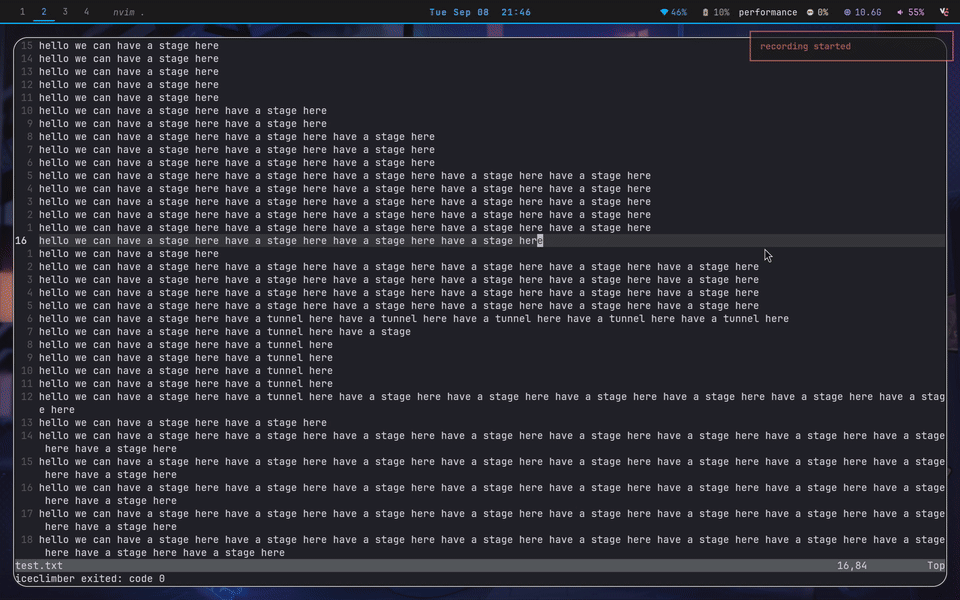

# iceclimber

currently only works on Hyprland. sorry! more support to come in the future.

`h`       left
`l`       right
`<space>` jump
`q`       quit

## WIP
this project is **heavily** work-in-progress. to see a list of what i'm planning
in the near future, check out `next.txt`!

## how it works
this was a really random project idea i had a while ago, and i'm so happy i've been
able to make it come true. here's the general structure of how this works:

### the go binary
the sprite is rendered by a relatively compact go binary that does the bulk of the
work for this plugin. the binary handles the rendering via a custom-rolled GTK game
engine, collisions, most of the tcp connection, neovim event handling, and has its 
hands in everything that has to do with how you interact with the game.
if you install now, you will see a pink debug overlay.

### the lua plugin
this is the part you're used to. a neovim plugin written in lua that creates some user
commands. when you use `:IceClimberStart`, it spawns an instance of the go binary. then
it forces some settings (don't worry! we store these for later) to make the game work nicer.
after that, it connects to a tcp socket that the go binary is listening on, does a little handshake,
and then begins sending golang information about the current viewport for rendering.

### other interesting stuff about it
- uses nvim api to offset the platforms to the right depending on line numbers, gitsigns,
and other shenanigans you may have over there
- defers a graceful close, regardless of if you use q to quit or :IceClimberStop (this is a
good command to know about if you somehow get trapped outside of the GTK window)
- uses cgo... this one's more depressing than interesting but worth noting that i had no choice

### want to use it?
installation + setup instructions coming soon. if you know how to do a local nvim plugin, do that
and then point it at the go binary.
if you just want to test out the renderer, you can download the binary from the releases page and
run it standalone with `./iceclimber --standalone`
** AGAIN I WARN THIS ONLY WORKS ON ARCH LINUX WITH HYPRLAND **
